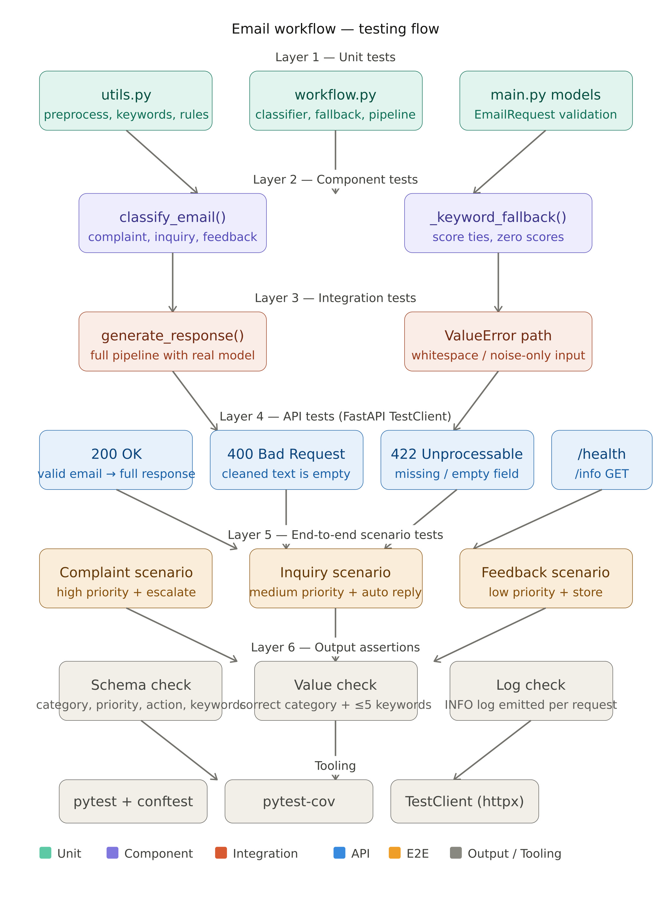

# AI Email Workflow

A clean, minimal **FastAPI** service that classifies incoming emails and
recommends the next action. It implements a small end-to-end workflow:

```
Input  ->  Process  ->  Decision  ->  Output
email      clean +      classify     structured
text       keywords     (ML model)   JSON response
```

The classifier is a small **scikit-learn** pipeline (TF-IDF + Logistic
Regression) trained on a handful of labelled examples at startup, with
a keyword-based fallback so the service stays available even if the
model fails to load.

---

## Project structure

```
email-workflow/
├── main.py            # FastAPI app, routes, request/response models
├── workflow.py        # Core logic: training, classification, decision
├── utils.py           # Helpers: text cleaning, keywords, category rules
├── requirements.txt   # Python dependencies
└── README.md
```

Five files total — easy to read top to bottom in a few minutes.

---

## Quick start

### 1. Install dependencies

```bash
cd email-workflow
python -m venv .venv
source .venv/bin/activate          # Windows: .venv\Scripts\activate
pip install -r requirements.txt
```

### 2. Run the server

```bash
uvicorn main:app --reload
```

The API is now available at <http://localhost:8000>. Interactive docs
(Swagger UI) are at <http://localhost:8000/docs>.

---

## API

### `POST /process-email`

**Request body**

```json
{
  "email_text": "I am very disappointed, my order never arrived. I want a refund."
}
```

**Response**

```json
{
  "category": "complaint",
  "priority": "high",
  "recommended_action": "escalate to support team",
  "keywords": ["disappointed", "order", "never", "arrived", "refund"]
}
```

### Decision rules

| Category   | Priority | Recommended action          |
| ---------- | -------- | --------------------------- |
| complaint  | high     | escalate to support team    |
| inquiry    | medium   | send auto response          |
| feedback   | low      | store for review            |

### Other endpoints

| Method | Path             | Description                |
| ------ | ---------------- | -------------------------- |
| GET    | `/`              | Service info               |
| GET    | `/health`        | Lightweight health check   |
| POST   | `/process-email` | Classify an email body     |

---

## Example requests

### Complaint

```bash
curl -X POST http://localhost:8000/process-email \
  -H "Content-Type: application/json" \
  -d '{"email_text": "This is unacceptable, my order never arrived and no one is responding."}'
```

```json
{
  "category": "complaint",
  "priority": "high",
  "recommended_action": "escalate to support team",
  "keywords": ["unacceptable", "order", "never", "arrived", "responding"]
}
```

### Inquiry

```bash
curl -X POST http://localhost:8000/process-email \
  -H "Content-Type: application/json" \
  -d '{"email_text": "Hi, could you please tell me the price of the enterprise plan?"}'
```

```json
{
  "category": "inquiry",
  "priority": "medium",
  "recommended_action": "send auto response",
  "keywords": ["could", "tell", "price", "enterprise", "plan"]
}
```

### Feedback

```bash
curl -X POST http://localhost:8000/process-email \
  -H "Content-Type: application/json" \
  -d '{"email_text": "Loving the recent updates, the app feels much faster now."}'
```

```json
{
  "category": "feedback",
  "priority": "low",
  "recommended_action": "store for review",
  "keywords": ["loving", "recent", "updates", "app", "feels"]
}
```

---

## Error handling

| Situation                              | HTTP status | Example response                                        |
| -------------------------------------- | ----------- | ------------------------------------------------------- |
| Missing `email_text` field             | 422         | `{"detail": [...]}`                                     |
| Empty / whitespace-only `email_text`   | 422         | `{"detail": [...]}`                                     |
| Cleaned text becomes empty (only noise)| 400         | `{"detail": "Email text is empty after preprocessing"}` |
| Unexpected internal error              | 500         | `{"detail": "Internal error while processing the email"}` |

---

## Logging

Each request logs the predicted category, priority, and the keywords
that drove the decision. Format:

```
2026-04-28 12:00:00,000 | INFO | email-workflow | Processed email | category=complaint priority=high keywords=['refund', 'order']
```

This makes it easy to ship the logs into any standard log collector
(CloudWatch, Datadog, ELK) without extra configuration.

---

## Design notes

* **Single responsibility per file.** `utils.py` is pure helpers,
  `workflow.py` owns the ML pipeline, `main.py` wires HTTP to the
  workflow. No circular imports, no clever abstractions.
* **Train once, serve fast.** The classifier is built inside FastAPI's
  `lifespan` so the model is fitted a single time at startup, not on
  every request.
* **Resilient classification.** If the ML model ever fails, a small
  keyword-based fallback keeps the API responding.
* **Strict input validation.** Pydantic enforces a non-empty,
  reasonably sized `email_text`, so the workflow code can stay focused
  on the happy path.

  ## System Workflow



This diagram explains the complete testing and workflow pipeline of the system, including unit tests, API behavior, and end-to-end scenarios.